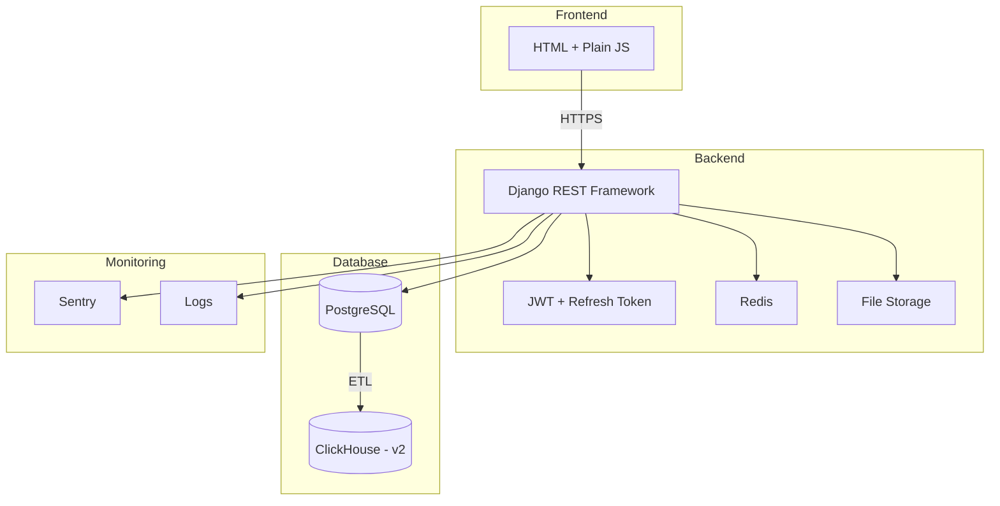

# 📋 Project Context: LMS Alternative MVP

> **Версия**: 1.0  
> **Дата**: 17.03.2026  
> **Основано на**: ТЗ_v2.md

---

## 🎯 1. Обзор проекта

**Название**: MVP-система альтернативы ЛМС (Learning Management System)

**Цель**: Создать минимально жизнеспособную веб-систему для управления обучением сотрудников с возможностью расширения до корпоративного обучающего портала.

**Ключевые функции**:
- Управление курсами и модулями
- Прохождение курсов с тестами
- Отслеживание прогресса
- Бронирование обучающих ресурсов (аудитории, тренеры)
- Аналитика по обучению
- Аутентификация и авторизация (JWT + refresh token)
- Система уведомлений

---

## 🧱 2. Архитектура системы

### 2.1 Общая архитектура

```
[Frontend: HTML + Plain JS] ← HTTPS → [Backend: Django (Python)] ←→ [PostgreSQL]
                                                               ↓
                                                       [ClickHouse] ← (ETL, v2)
                                                               ↑
                                                          [Redis] ← кэширование
                                                               ↑
                                                     [File Storage] ← файлы (PDF, видео)
```

### 2.2 Технологический стек

| Компонент | Технология | Версия/Детали |
|-----------|------------|---------------|
| **Backend** | Python + Django + Django REST Framework | Python 3.14, Django 6.0.3, DRF 3.17.0 |
| **Frontend** | HTML, Plain JavaScript | Без фреймворков |
| **Основная БД** | PostgreSQL | 15.x |
| **Аналитическая БД** | ClickHouse | v2 (будущее) |
| **Кэш** | Redis | 7.3.0 |
| **Хранилище файлов** | S3 или локальное | Для PDF, видео |
| **Аутентификация** | JWT + refresh token | bcrypt 5.0.0, simplejwt 5.5.1 |
| **Логирование** | Sentry + структурированное логирование | |
| **Хостинг** | Docker + Nginx | Локально или в облаке |

### 2.3 Диаграмма архитектуры



---

## 📁 3. Структура проекта

### 3.1 Структура директорий Django проекта

```
lms-system/
├── docker/
│   ├── Dockerfile
│   ├── docker-compose.yml
│   └── nginx.conf
├── backend/
│   ├── manage.py
│   ├── requirements.txt
│   ├── .env.example
│   ├── config/
│   │   ├── __init__.py
│   │   ├── settings/
│   │   │   ├── __init__.py
│   │   │   ├── base.py
│   │   │   ├── development.py
│   │   │   └── production.py
│   │   ├── urls.py
│   │   └── wsgi.py
│   ├── apps/
│   │   ├── users/              # Управление пользователями
│   │   │   ├── __init__.py
│   │   │   ├── models.py
│   │   │   ├── serializers.py
│   │   │   ├── views.py
│   │   │   ├── urls.py
│   │   │   ├── permissions.py
│   │   │   └── services.py
│   │   ├── courses/            # Курсы и модули
│   │   │   ├── __init__.py
│   │   │   ├── models.py
│   │   │   ├── serializers.py
│   │   │   ├── views.py
│   │   │   ├── urls.py
│   │   │   └── services.py
│   │   ├── quizzes/            # Тесты и попытки
│   │   │   ├── __init__.py
│   │   │   ├── models.py
│   │   │   ├── serializers.py
│   │   │   ├── views.py
│   │   │   ├── urls.py
│   │   │   └── services.py
│   │   ├── progress/           # Прогресс пользователей
│   │   │   ├── __init__.py
│   │   │   ├── models.py
│   │   │   ├── serializers.py
│   │   │   ├── views.py
│   │   │   ├── urls.py
│   │   │   └── services.py
│   │   ├── bookings/           # Бронирование ресурсов
│   │   │   ├── __init__.py
│   │   │   ├── models.py
│   │   │   ├── serializers.py
│   │   │   ├── views.py
│   │   │   ├── urls.py
│   │   │   └── services.py
│   │   └── notifications/      # Уведомления
│   │       ├── __init__.py
│   │       ├── models.py
│   │       ├── serializers.py
│   │       ├── views.py
│   │       ├── urls.py
│   │       └── services.py
│   ├── core/                   # Общая логика
│   │   ├── __init__.py
│   │   ├── permissions.py
│   │   ├── pagination.py
│   │   ├── exceptions.py
│   │   └── utils.py
│   ├── static/                 # Статические файлы
│   ├── media/                  # Загруженные файлы
│   └── tests/                  # Тесты
│       ├── unit/
│       ├── integration/
│       └── e2e/
├── frontend/
│   ├── index.html
│   ├── css/
│   │   └── styles.css
│   ├── js/
│   │   ├── api.js              # API клиент
│   │   ├── auth.js             # Аутентификация
│   │   ├── courses.js          # Курсы
│   │   ├── quizzes.js          # Тесты
│   │   ├── bookings.js         # Бронирование
│   │   └── main.js             # Главный файл
│   └── assets/                 # Изображения, иконки
├── scripts/
│   ├── etl_clickhouse.py       # ETL скрипт (v2)
│   └── backup.sh               # Бэкап БД
└── docs/
    ├── api/                    # Документация API (Swagger)
    └── deployment/             # Инструкции по деплою
```

### 3.2 Описание Django приложений

| Приложение | Назначение | Основные модели |
|------------|------------|-----------------|
| **users** | Управление пользователями, аутентификация | User, RefreshToken, PasswordResetToken |
| **courses** | Курсы, модули, записи на курсы | Course, Module, CourseEnrollment |
| **quizzes** | Тесты, варианты ответов, попытки | Quiz, QuizOption, QuizAttempt, QuizAnswer |
| **progress** | Прогресс пользователей по модулям | UserProgress |
| **bookings** | Ресурсы и бронирования | Resource, Booking |
| **notifications** | Уведомления пользователей | Notification |

---

## 🗄 4. Структура базы данных

### 4.1 Основные таблицы

#### Пользователи
- **users**: id, email, password_hash, full_name, role (admin/trainer/learner), is_active, created_at, updated_at
- **refresh_tokens**: id, user_id, token, expires_at, created_at, revoked_at
- **password_reset_tokens**: id, user_id, token, expires_at, used_at, created_at

#### Курсы и модули
- **courses**: id, title, description, status (draft/published/archived), created_at, updated_at
- **course_enrollments**: id, user_id, course_id, enrolled_at, status (active/completed/dropped), completed_at
- **modules**: id, course_id, title, content_type (text/pdf/video), content_text, content_url, order_num, created_at, updated_at

#### Тесты
- **quizzes**: id, module_id, question, question_type (single/multiple/open), order_num, created_at
- **quiz_options**: id, quiz_id, text, is_correct, order_num
- **quiz_attempts**: id, user_id, quiz_id, attempt_number, score, completed_at
- **quiz_answers**: id, attempt_id, quiz_option_id, text, is_correct, created_at

#### Прогресс
- **user_progress**: id, user_id, module_id, status (not_started/in_progress/completed), completed_at, score

#### Ресурсы и бронирования
- **resources**: id, name, type (classroom/trainer/equipment), description, capacity, is_active, created_at
- **bookings**: id, resource_id, user_id, course_id, title, description, start_time, end_time, status (pending/confirmed/cancelled), created_at, updated_at

#### Уведомления
- **notifications**: id, user_id, type, title, message, is_read, created_at

### 4.2 Индексы

Все внешние ключи и часто используемые поля проиндексированы для оптимизации запросов.

---

## 🔐 5. Безопасность

### 5.1 Аутентификация и авторизация

- **Пароли**: Хеширование с использованием bcrypt
- **Токены**: JWT access token (8 часов) + refresh token (30 дней)
- **Роли**: admin, trainer, learner
- **CORS**: Только с доверенных доменов (фронтенд)
- **CSRF**: Django CSRF middleware для всех форм

### 5.2 Защита от атак

- **Rate limiting**: 100 запросов/минута на IP
- **Валидация**: Все входные данные проверяются на уровне API (Django serializers)
- **Логирование**: Входы (успешные/неудачные) с IP-адресом
- **Email валидация**: На уровне БД и API
- **Защита от перебора**: Rate limiting на /login
- **Уведомления**: О подозрительной активности

---

## 🎨 6. Стиль кода

### 6.1 Python (Django)

- **Стандарт**: PEP 8
- **Максимальная длина строки**: 120 символов
- **Импорты**: Стандартный порядок (stdlib, third-party, local)
- **Именование**:
  - Классы: `CamelCase`
  - Функции/переменные: `snake_case`
  - Константы: `UPPER_SNAKE_CASE`
- **Документация**: Docstrings для всех публичных функций и классов

### 6.2 JavaScript (Plain JS)

- **Стандарт**: Минимальные правила, читаемый код
- **Именование**:
  - Функции/переменные: `camelCase`
  - Константы: `UPPER_SNAKE_CASE`
  - Классы: `PascalCase`
- **Комментарии**: JSDoc для публичных функций

### 6.3 Общие принципы

- **DRY**: Don't Repeat Yourself
- **KISS**: Keep It Simple, Stupid
- **SOLID**: Принципы объектно-ориентированного дизайна
- **Code Review**: Обязательное для всех изменений

---

## 📊 7. API Дизайн

### 7.1 RESTful принципы

- **HTTP методы**: GET (чтение), POST (создание), PUT/PATCH (обновление), DELETE (удаление)
- **Статусы**: 200 (OK), 201 (Created), 204 (No Content), 400 (Bad Request), 401 (Unauthorized), 403 (Forbidden), 404 (Not Found), 500 (Server Error)
- **Формат**: JSON для всех запросов и ответов
- **Пагинация**: PageNumberPagination или LimitOffsetPagination
- **Фильтрация**: Query parameters для фильтрации и сортировки

### 7.2 Аутентификация API

- **Header**: `Authorization: Bearer <access_token>`
- **Refresh**: `/api/auth/refresh/` для обновления токена
- **Logout**: `/api/auth/logout/` для отзыва refresh token

### 7.3 Документация

- **Инструмент**: Swagger/OpenAPI (drf-spectacular)
- **Доступ**: `/api/docs/` или `/api/redoc/`

---

## 🧪 8. Тестирование

### 8.1 Типы тестов

| Тип | Инструмент | Покрытие |
|-----|------------|----------|
| Unit-тесты | pytest | >70% |
| Интеграционные | pytest | >50% |
| E2E | Playwright или Cypress | Критические сценарии |
| Нагрузочные | Locust | |

### 8.2 Организация тестов

```
tests/
├── unit/
│   ├── test_models.py
│   ├── test_serializers.py
│   └── test_services.py
├── integration/
│   ├── test_api_auth.py
│   ├── test_api_courses.py
│   └── test_api_quizzes.py
└── e2e/
    ├── test_login_flow.py
    ├── test_course_completion.py
    └── test_booking_flow.py
```

---

## 🚀 9. CI/CD и Деплой

### 9.1 CI/CD

- **Платформа**: GitHub Actions или GitLab CI
- **Этапы**:
  1. Линтеры (flake8, eslint)
  2. Unit-тесты
  3. Интеграционные тесты
  4. Сборка Docker образа
  5. Деплой в тестовую среду

### 9.2 Деплой

- **Среды**: Development, Staging, Production
- **Инструменты**: Docker, Docker Compose, Nginx
- **База данных**: Миграции Django (makemigrations, migrate)
- **Статические файлы**: collectstatic

---

## 📈 10. Мониторинг и логирование

### 10.1 Логирование

- **Уровни**: DEBUG, INFO, WARNING, ERROR, CRITICAL
- **Формат**: Структурированное логирование (JSON)
- **Хранение**: Локальные файлы + отправка в Sentry

### 10.2 Мониторинг

- **Ошибки**: Sentry
- **Производительность**: <500ms для 95% запросов
- **Метрики**: CPU, RAM, Disk, Network

---

## 📱 11. Frontend требования

### 11.1 Технологии

- **HTML5**: Семантическая разметка
- **CSS3**: Flexbox/Grid для layout
- **JavaScript (ES6+)**: Без фреймворков
- **Адаптивность**: Mobile-first подход

### 11.2 Структура JS

- **api.js**: API клиент (fetch/axios)
- **auth.js**: Управление токенами, логин/логаут
- **courses.js**: Работа с курсами
- **quizzes.js**: Прохождение тестов
- **bookings.js**: Бронирование ресурсов
- **main.js**: Инициализация приложения

### 11.3 UI/UX

- **Чистый интерфейс**: Минималистичный дизайн
- **Отзывчивость**: Адаптивный для мобильных устройств
- **Доступность**: WCAG 2.1 AA
- **Уведомления**: Toast сообщения для действий пользователя

---

## 📝 14. Требования к качеству

- **Покрытие тестами**: Unit >70%, Integration >50%
- **Документация API**: Swagger/OpenAPI
- **Логирование**: Ошибки (Sentry), входы, бизнес-события
- **Мобильная поддержка**: Адаптивный интерфейс
- **Производительность**: <500ms для 95% запросов
- **Безопасность**: Отсутствие критических уязвимостей (OWASP Top 10)
- **Code Review**: Обязательное для всех изменений
- **CI/CD**: Автоматическое тестирование и деплой

---

## 📞 16. Контакты и ресурсы

- **ТЗ**: [`plans/ТЗ_v2.md`](../plans/ТЗ_v2.md)
- **Документация API**: `/api/docs/`

---

*Документ обновлён: 17.03.2026*
