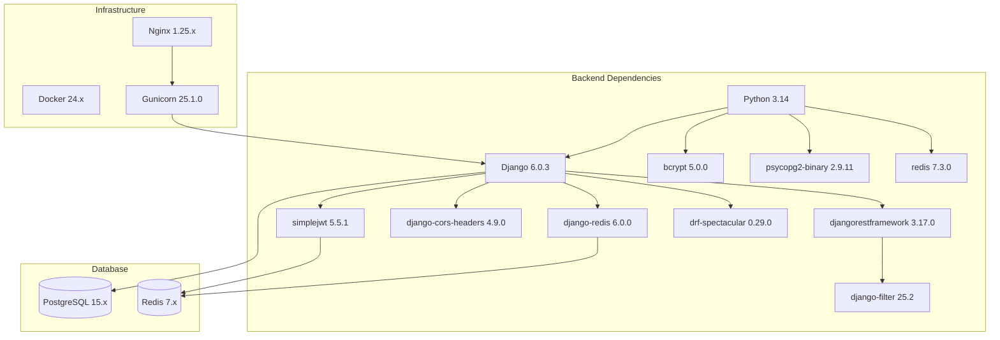

# 📋 План инициализации проекта LMS-системы

> **Дата создания**: 17.03.2026
> **Версия**: 1.0
> **Основано на**: ТЗ_v2.md

---

## 🎯 Цель

Инициализировать проект MVP-системы альтернативы ЛМС: создать структуру директорий, зафиксировать версии зависимостей, настроить базовую конфигурацию Django и Docker окружения.

---

## 📦 Стек технологий и версии библиотек

### Backend (Python/Django)

| Пакет | Версия | Назначение |
|-------|--------|------------|
| Python | 3.14.x | Основной язык |
| Django | 6.0.3 | Web-фреймворк |
| djangorestframework | 3.17.0 | REST API |
| djangorestframework-simplejwt | 5.5.1 | JWT аутентификация |
| bcrypt | 5.0.0 | Хеширование паролей |
| psycopg2-binary | 2.9.11 | Драйвер PostgreSQL |
| redis | 7.3.0 | Клиент Redis |
| django-redis | 6.0.0 | Кэширование в Redis |
| gunicorn | 25.1.0 | WSGI сервер |
| python-dotenv | 1.2.2 | Загрузка .env |
| django-cors-headers | 4.9.0 | CORS заголовки |
| drf-spectacular | 0.29.0 | Swagger/OpenAPI документация |
| django-filter | 25.2 | Фильтрация queryset |
| Pillow | 12.1.1 | Работа с изображениями |
| django-storages | 1.14.6 | S3 хранилище |
| boto3 | 1.42.73 | AWS SDK |

### Development dependencies

| Пакет | Версия | Назначение |
|-------|--------|------------|
| pytest | 8.3.5 | Тестирование |
| pytest-django | 4.10.0 | Интеграция pytest с Django |
| pytest-cov | 6.1.1 | Покрытие кода |
| factory-boy | 3.3.3 | Фабрики для тестов |
| black | 25.1.0 | Форматирование кода |
| isort | 6.0.1 | Сортировка импортов |
| flake8 | 7.2.0 | Линтер |
| mypy | 1.15.0 | Статическая типизация |
| django-stubs | 5.2.0 | Типы для Django |
| djangorestframework-stubs | 3.16.0 | Типы для DRF |
| pre-commit | 4.2.0 | Git hooks |
| django-debug-toolbar | 6.2.0 | Отладка |

### Production dependencies

| Пакет | Версия | Назначение |
|-------|--------|------------|
| uvicorn | 0.34.0 | ASGI сервер |
| sentry-sdk | 2.24.1 | Отслеживание ошибок |
| django-ratelimit | 4.1.0 | Rate limiting |

### Infrastructure

| Компонент | Версия | Назначение |
|-----------|--------|------------|
| PostgreSQL | 15.x | Основная БД |
| Redis | 7.x | Кэширование |
| Nginx | 1.25.x | Web-сервер |
| Docker | 24.x | Контейнеризация |

---

## 📁 Структура проекта

```
lms-system/
├── docker/
│   ├── Dockerfile
│   ├── Dockerfile.prod
│   ├── docker-compose.yml
│   ├── docker-compose.prod.yml
│   └── nginx/
│       └── nginx.conf
├── backend/
│   ├── manage.py
│   ├── requirements/
│   │   ├── base.txt
│   │   ├── development.txt
│   │   └── production.txt
│   ├── requirements.txt          # Ссылка на base.txt
│   ├── .env.example
│   ├── .gitignore
│   ├── config/
│   │   ├── __init__.py
│   │   ├── settings/
│   │   │   ├── __init__.py
│   │   │   ├── base.py
│   │   │   ├── development.py
│   │   │   └── production.py
│   │   ├── urls.py
│   │   ├── wsgi.py
│   │   └── asgi.py
│   ├── apps/
│   │   ├── __init__.py
│   │   ├── users/
│   │   │   ├── __init__.py
│   │   │   ├── models.py
│   │   │   ├── serializers.py
│   │   │   ├── views.py
│   │   │   ├── urls.py
│   │   │   ├── permissions.py
│   │   │   ├── services.py
│   │   │   ├── admin.py
│   │   │   └── migrations/
│   │   │       └── __init__.py
│   │   ├── courses/
│   │   │   ├── __init__.py
│   │   │   ├── models.py
│   │   │   ├── serializers.py
│   │   │   ├── views.py
│   │   │   ├── urls.py
│   │   │   ├── services.py
│   │   │   ├── admin.py
│   │   │   └── migrations/
│   │   │       └── __init__.py
│   │   ├── quizzes/
│   │   │   ├── __init__.py
│   │   │   ├── models.py
│   │   │   ├── serializers.py
│   │   │   ├── views.py
│   │   │   ├── urls.py
│   │   │   ├── services.py
│   │   │   ├── admin.py
│   │   │   └── migrations/
│   │   │       └── __init__.py
│   │   ├── progress/
│   │   │   ├── __init__.py
│   │   │   ├── models.py
│   │   │   ├── serializers.py
│   │   │   ├── views.py
│   │   │   ├── urls.py
│   │   │   ├── services.py
│   │   │   ├── admin.py
│   │   │   └── migrations/
│   │   │       └── __init__.py
│   │   ├── bookings/
│   │   │   ├── __init__.py
│   │   │   ├── models.py
│   │   │   ├── serializers.py
│   │   │   ├── views.py
│   │   │   ├── urls.py
│   │   │   ├── services.py
│   │   │   ├── admin.py
│   │   │   └── migrations/
│   │   │       └── __init__.py
│   │   └── notifications/
│   │       ├── __init__.py
│   │       ├── models.py
│   │       ├── serializers.py
│   │       ├── views.py
│   │       ├── urls.py
│   │       ├── services.py
│   │       ├── admin.py
│   │       └── migrations/
│   │           └── __init__.py
│   ├── core/
│   │   ├── __init__.py
│   │   ├── permissions.py
│   │   ├── pagination.py
│   │   ├── exceptions.py
│   │   ├── utils.py
│   │   └── middleware.py
│   ├── static/
│   │   └── .gitkeep
│   ├── media/
│   │   └── .gitkeep
│   └── tests/
│       ├── __init__.py
│       ├── conftest.py
│       ├── unit/
│       │   └── __init__.py
│       ├── integration/
│       │   └── __init__.py
│       └── e2e/
│           └── __init__.py
├── frontend/
│   ├── index.html
│   ├── css/
│   │   └── styles.css
│   ├── js/
│   │   ├── api.js
│   │   ├── auth.js
│   │   ├── courses.js
│   │   ├── quizzes.js
│   │   ├── bookings.js
│   │   ├── notifications.js
│   │   └── main.js
│   └── assets/
│       └── .gitkeep
├── scripts/
│   └── backup.sh
├── docs/
│   └── api/
│       └── .gitkeep
├── .pre-commit-config.yaml
├── .editorconfig
├── README.md
└── Makefile
```

---

## 🔄 Порядок инициализации

### Шаг 1: Создание структуры директорий

Создать все директории и файлы-заглушки (.gitkeep, __init__.py).

### Шаг 2: Инициализация Git

```bash
git init
```

### Шаг 3: Создание requirements.txt

Файлы зависимостей в `backend/requirements/`:
- `base.txt` - основные зависимости
- `development.txt` - зависимости для разработки
- `production.txt` - зависимости для продакшена

### Шаг 4: Создание Django проекта

```bash
cd backend
django-admin startproject config .
```

### Шаг 5: Создание Django приложений

```bash
python manage.py startapp users apps/users
python manage.py startapp courses apps/courses
python manage.py startapp quizzes apps/quizzes
python manage.py startapp progress apps/progress
python manage.py startapp bookings apps/bookings
python manage.py startapp notifications apps/notifications
```

### Шаг 6: Настройка Docker

Создать:
- `docker/Dockerfile` - для разработки
- `docker/Dockerfile.prod` - для продакшена
- `docker/docker-compose.yml` - для разработки
- `docker/docker-compose.prod.yml` - для продакшена

### Шаг 7: Настройка Nginx

Создать `docker/nginx/nginx.conf` с базовой конфигурацией.

### Шаг 8: Настройка settings

Разделить настройки:
- `config/settings/base.py` - общие настройки
- `config/settings/development.py` - настройки разработки
- `config/settings/production.py` - настройки продакшена

### Шаг 9: Создание .env.example

Шаблон файла с переменными окружения.

### Шаг 10: Создание core модуля

Базовая логика:
- `core/permissions.py` - базовые права доступа
- `core/pagination.py` - пагинация
- `core/exceptions.py` - исключения
- `core/utils.py` - утилиты
- `core/middleware.py` - middleware

### Шаг 11: Создание базовой структуры frontend

HTML/CSS/JS файлы.

### Шаг 12: Создание конфигурационных файлов

- `.pre-commit-config.yaml`
- `.editorconfig`
- `Makefile`
- `README.md`

---

## 📋 Чеклист для проверки инициализации

- [ ] Структура директорий создана
- [ ] Git инициализирован
- [ ] requirements.txt создан с совместимыми версиями
- [ ] Django проект создан
- [ ] Django приложения созданы
- [ ] Docker файлы созданы
- [ ] Nginx конфигурация создана
- [ ] Settings разделены на base/development/production
- [ ] .env.example создан
- [ ] Core модуль создан
- [ ] Frontend структура создана
- [ ] Конфигурационные файлы созданы
- [ ] README.md создан с инструкциями

---

## 🔧 Команды для запуска

### Разработка

```bash
# Запуск через Docker
docker-compose -f docker/docker-compose.yml up -d

# Создание миграций
docker-compose -f docker/docker-compose.yml exec backend python manage.py makemigrations

# Применение миграций
docker-compose -f docker/docker-compose.yml exec backend python manage.py migrate

# Создание суперпользователя
docker-compose -f docker/docker-compose.yml exec backend python manage.py createsuperuser
```

### Продакшен

```bash
docker-compose -f docker/docker-compose.prod.yml up -d
```

---

## 📊 Диаграмма зависимостей



---

## ⚠️ Важные замечания

1. **Совместимость версий**: Все версии проверены на совместимость с Django 6.0
2. **Python 3.14**: Выбран как актуальная версия с хорошей производительностью
3. **PostgreSQL 15**: Последняя стабильная версия на момент создания плана
4. **Redis 7**: Требуется для кэширования и JWT токенов
5. **Docker**: Используется для изоляции окружения

---

*Документ создан: 17.03.2026*