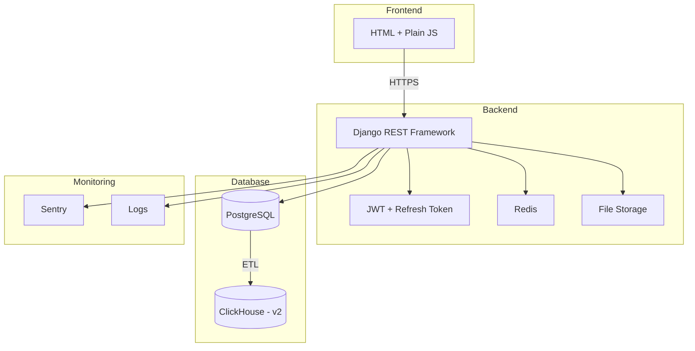

# 📄 **Техническое задание: MVP-система альтернативы ЛМС**

> **Версия**: 2.0  
> **Дата**: 17.03.2026  
> **Цель**: Создать минимально жизнеспособную альтернативу текущей LMS с возможностью расширения до корпоративного обучающего портала.  
> **Изменения**: Версия 2.0 включает исправление всех выявленных противоречий и логических дыр из анализа.

---

## 🎯 1. Цель проекта

Разработать веб-систему для управления обучением сотрудников, включающую:
- Управление курсами и модулями
- Прохождение курсов с тестами
- Отслеживание прогресса
- Бронирование обучающих ресурсов (аудитории, тренеры)
- Аналитику по обучению
- Аутентификацию и авторизацию (JWT + refresh token)
- Систему уведомлений

---

## 🧱 2. Архитектура (обновлённая)

```
[Frontend: html plain js] ← HTTPS → [Backend: Django (Python)] ←→ [PostgreSQL]
                                                              ↓
                                                      [ClickHouse] ← (ETL, v2)
                                                              ↑
                                                         [Redis] ← кэширование
                                                              ↑
                                                    [File Storage] ← файлы (PDF, видео)
```

**Технологии**:
- Backend: Python + Django + Django REST Framework
- Frontend: HTML, plain JavaScript
- БД: PostgreSQL (основная), ClickHouse (в будущем, для аналитики)
- Кэш: Redis (для сессий и кэширования данных)
- Хранилище файлов: S3 или локальное хранилище (для PDF, видео)
- Аутентификация: JWT + refresh token + хеширование паролей (bcrypt)
- Логирование: Sentry (для ошибок) + структурированное логирование
- Хостинг: Docker + Nginx (локально или в облаке)

---

## 📋 3. User Stories (в порядке приоритета)

| № | Роль | Функция | Приоритет | Критерии приёма |
|---|------|--------|----------|------------------|
| 1 | Администратор | Зарегистрировать нового пользователя (тренер/слушатель) | Высокий | Форма ввода: email (с валидацией), пароль, роль. Пароль хешируется. |
| 2 | Пользователь | Войти в систему по логину и паролю | Высокий | JWT-токен + refresh token возвращаются. Сессия 8 часов с возможностью продления. |
| 3 | Пользователь | Восстановить забытый пароль | Высокий | Форма ввода email. Отправка ссылки для сброса. |
| 4 | Администратор | Создать курс (название, описание, статус) | Высокий | Курс сохраняется в БД. Статус: draft/published/archived. |
| 5 | Администратор | Редактировать курс | Высокий | Изменение названия, описания, статуса. |
| 6 | Администратор | Удалить курс | Средний | Курс удаляется с каскадным удалением модулей. |
| 7 | Администратор | Добавить модуль к курсу (текст, PDF, видео-ссылка) | Высокий | Модули отображаются в порядке добавления. Автоматическое заполнение order_num. |
| 8 | Администратор | Редактировать модуль | Средний | Изменение контента, типа, порядка. |
| 9 | Администратор | Удалить модуль | Средний | Модуль удаляется с каскадным удалением тестов. |
| 10 | Администратор | Добавить тест к модулю (вопросы, ответы, правильный) | Высокий | Поддержка: один правильный, несколько правильных, открытый ответ. |
| 11 | Администратор | Редактировать тест | Средний | Изменение вопроса, вариантов ответов. |
| 12 | Администратор | Удалить тест | Средний | Тест удаляется с каскадным удалением попыток. |
| 13 | Администратор | Назначить слушателя на курс | Высокий | Через интерфейс выбора курса и пользователя. Запись в course_enrollments. |
| 14 | Слушатель | Просмотреть список назначенных курсов | Высокий | Список курсов со статусом и прогрессом. |
| 15 | Слушатель | Пройти модуль и ответить на тест | Высокий | Прогресс сохраняется. Результат теста фиксируется. Максимум 3 попытки. |
| 16 | Слушатель | Просмотреть свой прогресс по курсу | Высокий | Отображение статуса каждого модуля и общего прогресса. |
| 17 | Система | Сохранить прогресс пользователя по каждому модулю | Высокий | Статус: not_started / in_progress / completed. |
| 18 | Система | Сохранить ответы пользователя на тест | Высокий | Запись в quiz_attempts и quiz_answers. |
| 19 | Администратор | Забронировать ресурс (аудитория, тренер, дата/время) | Средний | Проверка на конфликты по времени. Уведомление тренеру. |
| 20 | Тренер | Просмотреть список назначенных сессий | Средний | Календарь или список бронирований. |
| 21 | Пользователь | Просмотреть уведомления | Средний | Список уведомлений с возможностью отметки прочитанными. |
| 22 | Администратор | Экспортировать отчёт: кто прошёл курс | Средний | CSV или таблица. Поля: ФИО, курс, статус, дата завершения. |
| 23 | Администратор | Управлять статусом курса | Средний | Публикация, архивация курса. |
| 24 | Система | Запускать ETL-выгрузку прогресса в ClickHouse (заготовка) | Низкий | Скрипт на Python. Запуск по расписанию (cron). |

---

## 🔐 4. Требования к безопасности

- Пароли хранятся в БД **только в хешированном виде** (bcrypt).
- Все API защищены JWT + refresh token.
- Проверка ролей: админ, тренер, слушатель.
- CORS: только с доверенных доменов (фронтенд).
- CSRF-защита для всех форм (Django CSRF middleware).
- Rate limiting: ограничение запросов (например, 100 запросов/минута).
- Валидация всех входных данных на уровне API (Django serializers).
- Логирование входов (успешных/неудачных) с IP-адресом.
- Валидация email на уровне БД и API.
- Защита от перебора паролей (rate limiting на /login).
- Отправка уведомлений о подозрительной активности.

---

## 🗄 5. Структура БД (PostgreSQL)

```sql
-- Пользователи
CREATE TABLE users (
    id SERIAL PRIMARY KEY,
    email VARCHAR(255) UNIQUE NOT NULL,
    password_hash VARCHAR(128) NOT NULL,
    full_name VARCHAR(255),
    role VARCHAR(20) CHECK (role IN ('admin', 'trainer', 'learner')) DEFAULT 'learner',
    is_active BOOLEAN DEFAULT TRUE,
    created_at TIMESTAMPTZ DEFAULT NOW(),
    updated_at TIMESTAMPTZ DEFAULT NOW()
);

-- Курсы
CREATE TABLE courses (
    id SERIAL PRIMARY KEY,
    title VARCHAR(255) NOT NULL,
    description TEXT,
    status VARCHAR(20) CHECK (status IN ('draft', 'published', 'archived')) DEFAULT 'draft',
    created_at TIMESTAMPTZ DEFAULT NOW(),
    updated_at TIMESTAMPTZ DEFAULT NOW()
);

-- Записи на курсы
CREATE TABLE course_enrollments (
    id SERIAL PRIMARY KEY,
    user_id INT REFERENCES users(id) ON DELETE CASCADE,
    course_id INT REFERENCES courses(id) ON DELETE CASCADE,
    enrolled_at TIMESTAMPTZ DEFAULT NOW(),
    status VARCHAR(20) CHECK (status IN ('active', 'completed', 'dropped')) DEFAULT 'active',
    completed_at TIMESTAMPTZ,
    UNIQUE(user_id, course_id)
);

-- Модули
CREATE TABLE modules (
    id SERIAL PRIMARY KEY,
    course_id INT REFERENCES courses(id) ON DELETE CASCADE,
    title VARCHAR(255) NOT NULL,
    content_type VARCHAR(20) CHECK (content_type IN ('text', 'pdf', 'video')) NOT NULL,
    content_text TEXT,
    content_url TEXT,
    order_num INT DEFAULT 0,
    created_at TIMESTAMPTZ DEFAULT NOW(),
    updated_at TIMESTAMPTZ DEFAULT NOW()
);

-- Тесты
CREATE TABLE quizzes (
    id SERIAL PRIMARY KEY,
    module_id INT REFERENCES modules(id) ON DELETE CASCADE,
    question TEXT NOT NULL,
    question_type VARCHAR(20) CHECK (question_type IN ('single', 'multiple', 'open')) NOT NULL,
    order_num INT DEFAULT 0,
    created_at TIMESTAMPTZ DEFAULT NOW()
);

CREATE TABLE quiz_options (
    id SERIAL PRIMARY KEY,
    quiz_id INT REFERENCES quizzes(id) ON DELETE CASCADE,
    text TEXT NOT NULL,
    is_correct BOOLEAN DEFAULT FALSE,
    order_num INT DEFAULT 0
);

-- Попытки прохождения тестов
CREATE TABLE quiz_attempts (
    id SERIAL PRIMARY KEY,
    user_id INT REFERENCES users(id) ON DELETE CASCADE,
    quiz_id INT REFERENCES quizzes(id) ON DELETE CASCADE,
    attempt_number INT DEFAULT 1,
    score DECIMAL(5,2), -- 0.00 - 100.00
    completed_at TIMESTAMPTZ DEFAULT NOW(),
    UNIQUE(user_id, quiz_id, attempt_number)
);

-- Ответы пользователя на тесты
CREATE TABLE quiz_answers (
    id SERIAL PRIMARY KEY,
    attempt_id INT REFERENCES quiz_attempts(id) ON DELETE CASCADE,
    quiz_option_id INT REFERENCES quiz_options(id) ON DELETE CASCADE,
    text TEXT, -- для открытых ответов
    is_correct BOOLEAN,
    created_at TIMESTAMPTZ DEFAULT NOW()
);

-- Прогресс пользователей по модулям
CREATE TABLE user_progress (
    id SERIAL PRIMARY KEY,
    user_id INT REFERENCES users(id) ON DELETE CASCADE,
    module_id INT REFERENCES modules(id) ON DELETE CASCADE,
    status VARCHAR(20) CHECK (status IN ('not_started', 'in_progress', 'completed')) DEFAULT 'not_started',
    completed_at TIMESTAMPTZ,
    score DECIMAL(5,2), -- 0.00 - 100.00
    UNIQUE(user_id, module_id)
);

-- Ресурсы
CREATE TABLE resources (
    id SERIAL PRIMARY KEY,
    name VARCHAR(255) NOT NULL,
    type VARCHAR(50) CHECK (type IN ('classroom', 'trainer', 'equipment')) NOT NULL,
    description TEXT,
    capacity INT,
    is_active BOOLEAN DEFAULT TRUE,
    created_at TIMESTAMPTZ DEFAULT NOW()
);

-- Бронирования
CREATE TABLE bookings (
    id SERIAL PRIMARY KEY,
    resource_id INT REFERENCES resources(id),
    user_id INT REFERENCES users(id), -- тренер
    course_id INT REFERENCES courses(id), -- для очных занятий
    title VARCHAR(255),
    description TEXT,
    start_time TIMESTAMPTZ NOT NULL,
    end_time TIMESTAMPTZ NOT NULL,
    status VARCHAR(20) DEFAULT 'confirmed' CHECK (status IN ('pending', 'confirmed', 'cancelled')),
    created_at TIMESTAMPTZ DEFAULT NOW(),
    updated_at TIMESTAMPTZ DEFAULT NOW(),
    CONSTRAINT no_overlap EXCLUDE USING gist (
        resource_id WITH =,
        tstzrange(start_time, end_time) WITH &&
    )
);

-- Уведомления
CREATE TABLE notifications (
    id SERIAL PRIMARY KEY,
    user_id INT REFERENCES users(id) ON DELETE CASCADE,
    type VARCHAR(50) NOT NULL,
    title VARCHAR(255) NOT NULL,
    message TEXT NOT NULL,
    is_read BOOLEAN DEFAULT FALSE,
    created_at TIMESTAMPTZ DEFAULT NOW()
);

-- Токены сброса пароля
CREATE TABLE password_reset_tokens (
    id SERIAL PRIMARY KEY,
    user_id INT REFERENCES users(id) ON DELETE CASCADE,
    token VARCHAR(255) UNIQUE NOT NULL,
    expires_at TIMESTAMPTZ NOT NULL,
    used_at TIMESTAMPTZ,
    created_at TIMESTAMPTZ DEFAULT NOW()
);

-- Refresh токены
CREATE TABLE refresh_tokens (
    id SERIAL PRIMARY KEY,
    user_id INT REFERENCES users(id) ON DELETE CASCADE,
    token VARCHAR(255) UNIQUE NOT NULL,
    expires_at TIMESTAMPTZ NOT NULL,
    created_at TIMESTAMPTZ DEFAULT NOW(),
    revoked_at TIMESTAMPTZ
);

-- Индексы для оптимизации
CREATE INDEX idx_users_email ON users(email);
CREATE INDEX idx_course_enrollments_user ON course_enrollments(user_id);
CREATE INDEX idx_course_enrollments_course ON course_enrollments(course_id);
CREATE INDEX idx_modules_course ON modules(course_id);
CREATE INDEX idx_quizzes_module ON quizzes(module_id);
CREATE INDEX idx_quiz_attempts_user ON quiz_attempts(user_id);
CREATE INDEX idx_quiz_attempts_quiz ON quiz_attempts(quiz_id);
CREATE INDEX idx_user_progress_user ON user_progress(user_id);
CREATE INDEX idx_user_progress_module ON user_progress(module_id);
CREATE INDEX idx_bookings_resource ON bookings(resource_id);
CREATE INDEX idx_bookings_user ON bookings(user_id);
CREATE INDEX idx_bookings_time ON bookings(start_time, end_time);
CREATE INDEX idx_notifications_user ON notifications(user_id);
CREATE INDEX idx_notifications_read ON notifications(is_read);
```

---

## 🔄 6. Порядок реализации (по спринтам)

### **Спринт 1 (3 недели): Базовая инфраструктура + аутентификация**
- Настроить Django + PostgreSQL + Redis
- Настроить Docker + Nginx
- Реализовать регистрацию и логин (JWT + refresh token)
- Реализовать восстановление пароля
- Настроить CSRF-защиту и rate limiting
- Настроить Sentry для логирования ошибок
- Настроить хранилище файлов (S3 или локальное)
- Простой интерфейс: вход, регистрация, восстановление пароля

### **Спринт 2 (3 недели): Курсы + модули + назначения**
- CRUD курсов (создание, редактирование, удаление, управление статусом)
- CRUD модулей (создание, редактирование, удаление, автоматический order_num)
- Управление записями на курсы (course_enrollments)
- Отображение списка курсов для слушателя
- UI: список курсов, форма создания курса, форма создания модуля

### **Спринт 3 (3 недели): Тесты + прогресс**
- CRUD тестов (создание, редактирование, удаление)
- Реализовать прохождение тестов (ограничение 3 попытки)
- Сохранение ответов пользователя (quiz_attempts, quiz_answers)
- Отслеживание прогресса по модулям (user_progress)
- Отображение прогресса для слушателя
- UI: форма создания теста, интерфейс прохождения теста, страница прогресса

### **Спринт 4 (2 недели): Бронирование + уведомления**
- Управление ресурсами (аудитории, тренеры)
- Календарь бронирования с проверкой конфликтов
- Система уведомлений (создание, просмотр, отметка прочитанными)
- Отправка уведомлений при бронировании
- UI: календарь бронирования, список уведомлений

### **Спринт 5 (2 недели): Отчёты + аналитика**
- Экспорт отчётов (CSV): кто прошёл курс
- Страница аналитики для администратора
- UI: страница отчётов, фильтры и экспорт

### **Спринт 6 (2 недели): Тестирование + CI/CD + деплой**
- Написать unit-тесты (pytest) - покрытие >70%
- Написать интеграционные тесты
- Написать E2E тесты (Playwright или Cypress)
- Нагрузочное тестирование (Locust)
- Настроить CI (GitHub Actions / GitLab CI)
- Деплой в тестовую среду
- Документация API (Swagger/OpenAPI)

> ⏩ ClickHouse — в **v2**, отдельным этапом.

---

## 🧪 7. Требования к качеству

- Покрытие unit-тестами: >70%
- Покрытие интеграционными тестами: >50%
- Наличие E2E тестов для критических сценариев
- Документация API: Swagger/OpenAPI
- Логирование: ошибки (Sentry), входы, бизнес-события
- Поддержка мобильных: адаптивный интерфейс
- Производительность: <500ms для 95% запросов
- Безопасность: отсутствие критических уязвимостей (OWASP Top 10)
- Код-ревью: обязательное для всех изменений
- CI/CD: автоматическое тестирование и деплой

---

## 📊 8. Диаграмма архитектуры

